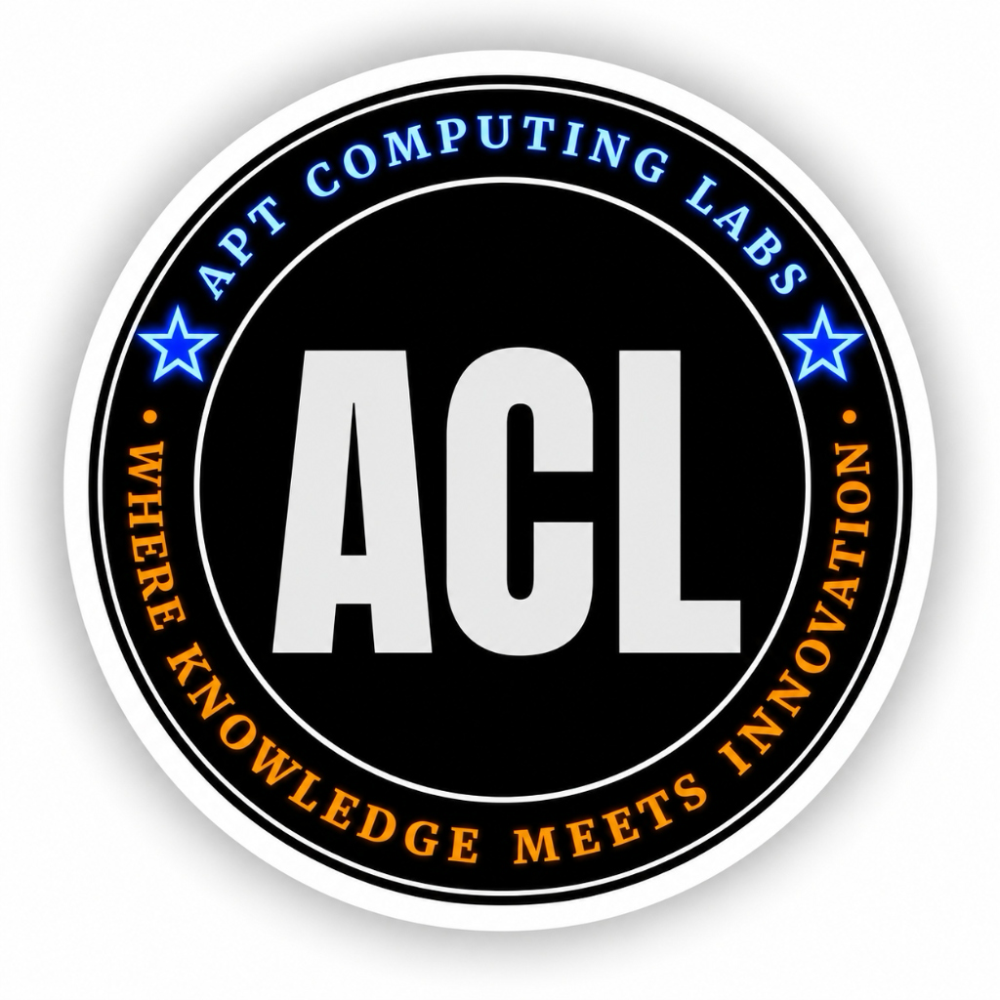

<div align="center">
  
  <h2>Apt Computing Labs</h2>
  <p><strong>WHERE KNOWLEDGE MEETS INNOVATION</strong></p>
</div>

# Mastering Zephyr RTOS on STM32: The Complete Hands-On Guide

Welcome to **Mastering Zephyr RTOS on STM32**, a comprehensive digital book and interactive learning platform published by **Apt Computing Labs** for students, embedded systems engineers, and firmware professionals.

> *“There is no way around hard work. Embrace it. You have to put in the hours because there is always something which you can improve.”*  
> — **Roger Federer**

---

## 📖 Book Overview & Architecture

This repository contains the complete interactive digital book (HTML/CSS/JS) along with production-tested Zephyr RTOS sample projects targeted for the STM32 Nucleo family.

### Target Platforms
- **STMicroelectronics Nucleo-F401RE** (ARM Cortex-M4 @ 84MHz, 512KB Flash, 96KB SRAM)
- **STMicroelectronics Nucleo-G071RB** (ARM Cortex-M0+ @ 64MHz, 128KB Flash, 36KB SRAM)
- **STMicroelectronics Nucleo-L476RG** (ARM Cortex-M4 with FPU @ 80MHz, ultra-low-power, 1MB Flash, 128KB SRAM)

---

## 🚀 Interactive Digital Book Features

The web-based digital book is located in the root of this repository. You can open `index.html` directly in any modern browser without requiring complex backend servers or node dependencies!

Key interactive features:
- **Instant Search:** Full-text instant search across all chapters, topics, and code snippets.
- **Interactive DeviceTree Visualizer:** Understand node syntax, phandles, and overlay resolution visually.
- **Copy-to-Clipboard & Syntax Highlighting:** One-click copying of commands, `.overlay`, and C code.
- **Progress Tracking & Bookmarks:** Automatically saves your reading and lab completion progress locally.
- **Board Switcher:** Filter hardware specifics, pin mappings, and `west build -b ...` commands for your specific Nucleo board.
- **Collapsible Vertical Navigation:** Hide or show the vertical navigation tab with a click or keyboard shortcut `<kbd>[</kbd>`.
- **Knowledge Checks:** Quizzes at the end of modules to reinforce learning.

---

## 📚 Curriculum Structure

| Module | Title | Key Topics |
| :--- | :--- | :--- |
| **01** | **Foundations & Toolchain** | The Need for an OS, FreeRTOS limitations, Why Zephyr, `west`, Zephyr SDK, STM32 ST-Link, Dual Blinky & VCP UART |
| **02** | **DeviceTree & Kconfig** | DTS syntax, bindings, phandles, STM32 board overlays, Kconfig symbols & `prj.conf` |
| **03** | **Zephyr Kernel Core** | Multithreading, priorities, Semaphores, Mutexes, Message Queues, Workqueues, ISRs |
| **04** | **STM32 Peripherals & Drivers** | GPIO interrupts, Async UART, I2C Sensor drivers, SPI, PWM dimming, ADC, Low-power PM |
| **05** | **Subsystems & Connectivity** | Zephyr Shell, deferred Logger, CAN bus (bxCAN/FDCAN), BLE integration strategies |
| **06** | **Production & Capstone** | MCUBoot DFU, Twister & Ztest testing, GDB/OpenOCD, Industrial Watchdog Capstone |

---

## 🛠️ Code Samples Directory

All practical labs come with full source code ready to build with Zephyr RTOS:

```bash
samples/
├── 01_blinky_vcp/                 # Lab 1: Dual LED & USART2 ST-Link VCP
├── 02_devicetree_overlay/         # Lab 2: Custom DTS overlays & external GPIOs
├── 03_kernel_threads_queues/      # Lab 3: Multi-threaded sensor processing pipeline
├── 04_sensor_i2c_pwm/             # Lab 4: I2C environmental sensor + PWM status
├── 05_shell_telemetry/            # Lab 5: Interactive Zephyr Shell & command handlers
└── 06_capstone_industrial_monitor/# Lab 6: Industrial supervisor with watchdog & recovery
```

### Quick Build Example

```bash
# Navigate to any sample
cd samples/01_blinky_vcp

# Build for Nucleo-F401RE
west build -b nucleo_f401re

# Flash via ST-Link
west flash
```

---

## 💻 Opening the Book

Simply open `index.html` in your browser:
```bash
open index.html   # On macOS
# or start a lightweight server:
python3 -m http.server 8000
```

---

## ⚖️ Copyright & Proprietary Rights

**Copyright © 2026 Apt Computing Labs. All Rights Reserved.**  
*Where Knowledge Meets Innovation.*

This digital book, curriculum materials, interactive tools, and accompanying Zephyr RTOS sample code are proprietary educational assets authored and published by **Apt Computing Labs**. 

All trade names, trademarks, and logos (including the **ACL / Apt Computing Labs** emblem and tagline) are the exclusive intellectual property of Apt Computing Labs. Unauthorized distribution or copying without explicit written permission is strictly prohibited.
